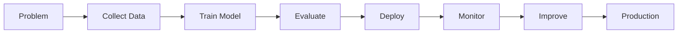

<!-- ========================================================= -->
<!--                 PREMIUM AI ENGINEER PROFILE               -->
<!-- ========================================================= -->

<p align="center">

</p>

<p align="center">

</p>

<p align="center">

<a href="mailto:afzalmohamed098@gmail.com">

</a>

<a href="https://www.linkedin.com/in/mohamed-afzal-6732a7202/">

</a>

<a href="https://github.com/MohamedAfzal0719">

</a>


</p>

---

# 👋 Hello World!

```python
class MohamedAfzal:

    def __init__(self):

        self.name = "Mohamed Afzal S"

        self.role = "AI/ML Engineer"

        self.location = "Chennai, India"

        self.company = "Enarxi Innovation Pvt Ltd"

        self.interests = [

            "Computer Vision",

            "Generative AI",

            "LLMs",

            "RAG",

            "FastAPI",

            "Backend Development"

        ]

    def life_goal(self):

        return "Build intelligent AI systems that solve real-world industrial problems."

me = MohamedAfzal()

print(me.life_goal())
```

---

# 🚀 About Me


### AI Engineer focused on building intelligent systems.

I'm passionate about developing scalable AI applications powered by **Computer Vision**, **Large Language Models**, **Retrieval-Augmented Generation (RAG)**, and modern backend architectures.

I enjoy transforming complex business problems into production-ready AI solutions with measurable impact.

### Current Focus

- 🤖 Enterprise AI Agents
- 🧠 Large Language Models
- 📚 Retrieval-Augmented Generation
- 👁 Computer Vision
- ⚡ FastAPI APIs
- 🎯 Real-Time AI Systems
- ☁ Cloud-ready AI Backends
- 🔥 Production AI Deployment

---

# 💼 Professional Experience

## 🏢 AI/ML Engineer

### Enarxi Innovation Pvt Ltd

📍 Chennai, India

🗓 Feb 2026 — Present

---

## 🚧 Enterprise Projects

### 🔹 Conveyor Belt Monitoring System

Designed an industrial Computer Vision system capable of detecting conveyor belt defects in real time using **YOLOv8**, reducing manual inspection time while achieving high detection accuracy.

---

### 🔹 Material Detection & Classification

Built a real-time object detection pipeline capable of processing more than **30 FPS**, ensuring reliable industrial material classification.

---

### 🔹 Cement Bag Counting

Developed an automated counting solution using object detection and tracking with **99% counting accuracy**, replacing manual inventory verification.

---

### 🔹 BOM Automation

Developed an intelligent automation workflow that reduced manual processing time by approximately **60%** while improving extraction accuracy.

---

### 🔹 Enterprise AI Agent

Designed and developed an enterprise AI assistant using:

- FastAPI
- LLMs
- RAG
- PostgreSQL
- Vector Databases

The solution reduced document retrieval time from minutes to seconds.

---

# 📈 AI Engineering Impact

| 🚀 Metric | Achievement |
|------------|------------|
| Conveyor Belt Detection | **96% Accuracy** |
| Material Classification | **95% Accuracy** |
| Cement Bag Counting | **99% Accuracy** |
| Processing Speed | **30+ FPS** |
| BOM Automation | **60% Faster** |
| Data Extraction | **98% Accuracy** |
| AI Agent Retrieval | **Minutes → Seconds** |
| AI Inference | **Sub-second Response** |

---

# 🌌 My Expertise

```text
Artificial Intelligence
██████████████████████████ 95%

Computer Vision
████████████████████████ 92%

YOLOv8
███████████████████████ 90%

Generative AI
██████████████████████ 90%

LLMs
██████████████████████ 89%

FastAPI
█████████████████████ 88%

Backend Development
████████████████████ 86%

PostgreSQL
███████████████████ 84%
```

---

# ⚡ Tech Stack

## 👨‍💻 Programming Languages

<p align="center">

</p>

<div align="center">

Python • Java • JavaScript • SQL

</div>

---

## 🤖 Artificial Intelligence

<p align="center">


</p>

<div align="center">

Machine Learning

Deep Learning

Computer Vision

YOLOv8

LLMs

Generative AI

RAG

LangChain

LangGraph

OpenCV

NLP

Image Processing

</div>

---

## ⚙ Backend Development

<p align="center">


</p>

<div align="center">

FastAPI

Flask

REST APIs

Node.js

Express

Automation

Playwright

</div>

---

## 🗄 Databases

<p align="center">


</p>

<div align="center">

PostgreSQL

MongoDB

SQL

</div>

---

## 🛠 Development Tools

<p align="center">


</p>

<div align="center">

Git

GitHub

VS Code

Linux

</div>

---

<!-- END OF PART 1 -->
# 🚀 Featured Projects

<table>

<tr>

<td width="50%">

## 🚧 AI Conveyor Belt Monitoring System


### Overview

An enterprise-grade Computer Vision system developed for **JSW Steel** to automate conveyor belt inspection using YOLOv8.

### Highlights

- 🎯 96% Defect Detection Accuracy
- ⚡ Real-Time Detection
- 🎥 Live Camera Processing
- 🧠 Deep Learning
- 📈 Industrial Deployment
- 🚀 FastAPI Backend

### Tech Stack

```text
YOLOv8
OpenCV
FastAPI
Python
PostgreSQL
REST API
```

</td>

<td width="50%">

## 📦 Material Detection & Classification


### Overview

Industrial AI system capable of detecting and classifying multiple material types from conveyor streams in real time.

### Features

- Object Detection
- Material Classification
- Multi-class Recognition
- Real-Time AI
- High Accuracy
- Production Ready

### Performance

✔ 30+ FPS

✔ 95% Accuracy

✔ Low Latency

</td>

</tr>

</table>

---

<table>

<tr>

<td width="50%">

## 📦 Cement Bag Counting System


### Description

AI-powered object detection and tracking system used to automate inventory verification.

### Features

- Object Tracking
- Counting Pipeline
- Automated Reports
- High Accuracy
- Industrial Deployment

### Result

✅ 99% Counting Accuracy

</td>

<td width="50%">

## 🤖 Enterprise AI Agent


### Description

Enterprise assistant capable of intelligent document retrieval using LLMs and Retrieval-Augmented Generation.

### Features

- Context Retrieval
- RAG Pipeline
- Vector Search
- FastAPI
- PostgreSQL
- Intelligent Responses

### Result

⚡ Minutes → Seconds Retrieval

</td>

</tr>

</table>

---

<table>

<tr>

<td width="50%">

## 🧠 LangGraph AI Question Answering

### Technologies

- LangGraph
- FastAPI
- Gemini API
- RAG
- Python

### Features

- Multi-stage Workflow
- Query Validation
- Intent Detection
- Retry Logic
- Response Validation
- Document Retrieval

### Architecture

```
User

↓

Query Validation

↓

Retriever

↓

LLM

↓

Validator

↓

Final Response
```

</td>

<td width="50%">

## 🎬 AI Movie Synopsis Evaluation

### Technologies

- Flask
- Gemini API
- Python

### Features

- Genre Prediction
- Synopsis Analysis
- AI Scoring
- Prompt Engineering
- Multi-Agent Design
- Intelligent Evaluation

</td>

</tr>

</table>

---

<table>

<tr>

<td width="100%">

## 🍔 PuduSuvai Food Delivery Platform

### Tech Stack

Node.js

Express

MongoDB

JavaScript

REST APIs

### Features

- Restaurant Listing
- Cart Management
- Order Tracking
- Authentication
- Responsive UI
- Backend APIs

</td>

</tr>

</table>

---

# 💡 Technical Expertise

<table>

<tr>

<td width="50%">

## Artificial Intelligence

- Generative AI
- LLM Applications
- RAG
- LangChain
- LangGraph
- AI Agents
- Prompt Engineering
- NLP

</td>

<td width="50%">

## Computer Vision

- YOLOv8
- OpenCV
- Image Processing
- Object Detection
- Object Tracking
- Video Analytics
- Industrial Vision

</td>

</tr>

<tr>

<td width="50%">

## Backend Engineering

- FastAPI
- Flask
- REST APIs
- Node.js
- Express.js
- PostgreSQL
- MongoDB

</td>

<td width="50%">

## Software Engineering

- Git
- Linux
- Automation
- Debugging
- System Design
- API Development
- Production Deployment

</td>

</tr>

</table>

---

# 📊 Skills

| Technology | Level |
|------------|--------|
| Python | ████████████████████████ 95% |
| Computer Vision | ██████████████████████ 93% |
| YOLOv8 | █████████████████████ 91% |
| Generative AI | ████████████████████ 90% |
| LLMs | ████████████████████ 89% |
| RAG | ████████████████████ 89% |
| FastAPI | ███████████████████ 88% |
| PostgreSQL | ██████████████████ 86% |
| MongoDB | █████████████████ 84% |
| JavaScript | ████████████████ 80% |

---

# 🎯 Currently Learning

- Multi-Agent AI Systems
- AI Workflow Orchestration
- LangGraph Advanced Patterns
- Vector Databases
- Cloud AI Deployment
- Kubernetes for AI
- Docker
- MLOps

---

# 🌟 Career Goals

✔ Build Enterprise AI Platforms

✔ Design Intelligent Automation Systems

✔ Develop Production Computer Vision Solutions

✔ Scale Large Language Model Applications

✔ Become an AI Solutions Architect

✔ Contribute to Open Source AI

---

# 💬 Favorite Quote

> **"Artificial Intelligence is not about replacing humans; it's about amplifying human potential."**

---

<!-- END OF PART 2 -->
---

# 📊 GitHub Analytics

<p align="center">


</p>

---

# 🔥 GitHub Streak

<p align="center">


</p>

---

# 📈 Contribution Graph

<p align="center">


</p>

---

# 🏆 GitHub Trophies

<p align="center">


</p>

---

# 🐍 Contribution Snake

<p align="center">


</p>

---

# 📈 Development Activity

<table>

<tr>

<td align="center">

### 🚀 AI Engineering

✔ Computer Vision

✔ LLM Applications

✔ RAG Systems

✔ FastAPI

✔ Backend APIs

</td>

<td align="center">

### 💻 Development

✔ Python

✔ Java

✔ JavaScript

✔ PostgreSQL

✔ MongoDB

</td>

<td align="center">

### 🤖 AI Tools

✔ LangChain

✔ LangGraph

✔ YOLOv8

✔ OpenCV

✔ Gemini API

</td>

</tr>

</table>

---

# 🏅 Certifications

<table>

<tr>

<td>

🎓 **Besant Technologies**

Data Science

</td>

<td>

🤖 **NSP Nexus**

Artificial Intelligence & Machine Learning

</td>

</tr>

<tr>

<td>

🌐 **NSP Nexus**

Web Development

</td>

<td>

💻 **IBM**

Web Development

</td>

</tr>

</table>

---

# 🎓 Education

## Bachelor of Technology

### Computer Science & Engineering

🏫 **B.S. Abdur Rahman Crescent Institute of Science and Technology**

📍 Chennai, India

📅 2022 – 2026

---

# 💡 Core Competencies

<table>

<tr>

<td>

✔ Artificial Intelligence

✔ Machine Learning

✔ Deep Learning

✔ Computer Vision

✔ Generative AI

✔ Prompt Engineering

</td>

<td>

✔ REST APIs

✔ FastAPI

✔ Backend Development

✔ PostgreSQL

✔ MongoDB

✔ Git

</td>

<td>

✔ System Design

✔ Problem Solving

✔ Debugging

✔ Automation

✔ Team Collaboration

✔ Communication

</td>

</tr>

</table>

---

# 🌍 Connect With Me

<p align="center">

<a href="mailto:afzalmohamed098@gmail.com">


</a>

<a href="https://www.linkedin.com/in/mohamed-afzal-6732a7202/">


</a>

<a href="https://github.com/MohamedAfzal0719">


</a>

</p>

---

# 🚀 Fun Facts

```python
class AIEngineer:

    def __init__(self):

        self.name = "Mohamed Afzal"

        self.coffee = True

        self.debugging = True

        self.learning = "Everyday"

    def daily_routine(self):

        while True:

            Learn()

            Build()

            Deploy()

            Improve()

            Repeat()

me = AIEngineer()

print("Never stop building 🚀")
```

---

# 💬 Favorite Quote

> **"The best way to predict the future is to build it."**

---

<p align="center">

### ⭐ If you like my work, consider giving my repositories a star! ⭐

</p>

---

<p align="center">


</p>

<p align="center">

<h3 align="center">

⚡ Building Intelligent Systems with AI • Computer Vision • Generative AI ⚡

</h3>

</p>

<p align="center">


</p>

<!-- ========================================================= -->
<!--                END OF PREMIUM README                      -->
<!-- ========================================================= -->
---

# 🚀 AI Engineering Roadmap

```text
                AI Engineer Journey

Python
   │
   ├────────────► Machine Learning
   │                    │
   │                    ▼
   │             Deep Learning
   │                    │
   │                    ▼
   │           Computer Vision
   │                    │
   │          YOLOv8 • OpenCV
   │                    │
   │                    ▼
   │           Generative AI
   │                    │
   │         LLMs • Prompting
   │                    │
   │                    ▼
   │        LangChain • LangGraph
   │                    │
   │                    ▼
   │        RAG Applications
   │                    │
   │                    ▼
   │      Enterprise AI Agents
   │                    │
   │                    ▼
   └────────────► AI Solutions Architect
```

---

# 📊 Technology Radar

| Technology | Experience | Confidence |
|------------|------------|------------|
| Python | ⭐⭐⭐⭐⭐ | ███████████████████ |
| FastAPI | ⭐⭐⭐⭐⭐ | █████████████████ |
| YOLOv8 | ⭐⭐⭐⭐⭐ | █████████████████ |
| OpenCV | ⭐⭐⭐⭐⭐ | ████████████████ |
| Machine Learning | ⭐⭐⭐⭐⭐ | ████████████████ |
| Deep Learning | ⭐⭐⭐⭐☆ | ███████████████ |
| Generative AI | ⭐⭐⭐⭐⭐ | █████████████████ |
| LangChain | ⭐⭐⭐⭐☆ | ██████████████ |
| LangGraph | ⭐⭐⭐⭐☆ | █████████████ |
| PostgreSQL | ⭐⭐⭐⭐☆ | ████████████ |
| MongoDB | ⭐⭐⭐⭐☆ | ████████████ |
| JavaScript | ⭐⭐⭐⭐☆ | ███████████ |

---

# ⚙️ Development Workflow

```text
Idea
 │
 ▼
Research
 │
 ▼
Design
 │
 ▼
Prototype
 │
 ▼
Develop
 │
 ▼
Train
 │
 ▼
Validate
 │
 ▼
Deploy
 │
 ▼
Monitor
 │
 ▼
Improve
```

---

# 🏭 Industrial AI Solutions

| Solution | Status |
|----------|--------|
| 🚧 Conveyor Belt Monitoring | ✅ Production |
| 📦 Material Detection | ✅ Production |
| 🧮 Cement Bag Counting | ✅ Production |
| 🤖 Enterprise AI Agent | ✅ Production |
| 📚 LangGraph QA | ✅ Completed |
| 🎬 AI Movie Evaluation | ✅ Completed |

---

# 🎯 2026 Goals

- ✅ Build Enterprise AI Products
- ✅ Master LangGraph
- ✅ Deploy AI Agents
- ✅ Build Computer Vision Products
- 🔄 Learn Kubernetes
- 🔄 Learn Docker
- 🔄 Contribute to Open Source
- 🔄 Publish Technical Articles
- 🔄 Build SaaS AI Platform

---

# 📈 GitHub Contribution Goals

```text
Repositories      ████████████████
Commits           ███████████████████
Open Source       ████████████
AI Projects       ███████████████████
Backend APIs      ███████████████
Learning          ████████████████████
```

---

# 💻 Terminal

```bash
$ whoami

Mohamed Afzal S

$ role

AI/ML Engineer

$ company

Enarxi Innovation Pvt Ltd

$ skills

Python
FastAPI
YOLOv8
OpenCV
LLMs
LangGraph
LangChain
RAG
Computer Vision
Generative AI

$ mission

Build scalable AI systems that solve real-world industrial challenges.

$ status

🚀 Building...
```

---

# ☕ Let's Build Together

> "Great software isn't written by chance—it's built through curiosity, continuous learning, and solving meaningful problems."

<p align="center">

⭐ **Thanks for visiting my profile!**

If you enjoy my work, feel free to follow me and star my repositories.

</p>

---
---

# 🧠 AI Philosophy

<div align="center">

| 💭 Think | ⚡ Build | 🚀 Deploy | 📈 Improve |
|:--------:|:--------:|:---------:|:----------:|
| Research | Prototype | Production | Iterate |

</div>

> **"Artificial Intelligence is not just about writing models — it's about building systems that create measurable impact."**

---

# 🌍 Areas of Interest

<p align="center">


</p>

---

# 🔥 What I'm Currently Working On

```yaml
Company:
  Enarxi Innovation Pvt Ltd

Projects:

  - Conveyor Belt Monitoring

  - Material Detection

  - Cement Bag Counting

  - Enterprise AI Agent

  - AI Automation

Learning:

  - Multi-Agent AI

  - LangGraph

  - AI Orchestration

  - Cloud Deployment

Goal:

  Build production-grade AI systems.
```

---

# 🚀 AI Stack

```text
                 Enterprise AI

                     ▲

             AI Agents

                     ▲

        LLMs + RAG + Vector DB

                     ▲

        LangChain + LangGraph

                     ▲

      FastAPI + PostgreSQL

                     ▲

      YOLOv8 + OpenCV + Python

                     ▲

          Machine Learning

                     ▲

                 Python
```

---

# 📌 Featured Technologies

<p align="center">


</p>

---

# 💻 AI Engineering Workflow



---

# 📈 Engineering Mindset

```text
Write Code

↓

Build APIs

↓

Train Models

↓

Deploy AI

↓

Monitor

↓

Optimize

↓

Repeat
```

---

# 🎯 Current Mission

> Build scalable AI platforms capable of solving real-world industrial challenges using Computer Vision, Generative AI, and intelligent backend systems.

---

# ⚡ Favorite Tech

🐍 Python

⚡ FastAPI

🤖 YOLOv8

🧠 LangGraph

📚 LangChain

🎯 RAG

👁 OpenCV

🗄 PostgreSQL

☁ AI Automation

---

# 🌟 My Strengths

✅ Problem Solving

✅ System Design

✅ Backend Engineering

✅ AI Automation

✅ Computer Vision

✅ AI Agents

✅ LLM Applications

✅ REST APIs

---

# 🧩 Fun Terminal

```bash

> python profile.py

Loading...

███████████████████████

Name        : Mohamed Afzal S

Role        : AI/ML Engineer

Company     : Enarxi Innovation

Location    : Chennai

Speciality  : Computer Vision

Framework   : FastAPI

Favorite AI : YOLOv8 + RAG

Status      : Building Amazing Things 🚀

```

---

# 🧬 AI DNA

```python
class Engineer:

    def __init__(self):

        self.name="Mohamed Afzal"

        self.code=True

        self.ai=True

        self.sleep=False

    def life(self):

        while True:

            Learn()

            Build()

            Deploy()

            Improve()

Engineer().life()
```

---

# 💬 Motto

> **Dream Big. Build Bigger. Deploy Smart.**

---

# ❤️ Support

If you enjoy my projects,

⭐ Star my repositories

🤝 Connect on LinkedIn

🚀 Let's build AI together

---
---

# 🏆 Why Hire Me?

<table>
<tr>

<td width="50%">

### 🧠 AI Engineering

✔ Enterprise AI Applications

✔ Computer Vision

✔ YOLOv8

✔ LLM Applications

✔ RAG Architecture

✔ LangChain

✔ LangGraph

✔ Prompt Engineering

</td>

<td width="50%">

### ⚙ Backend Engineering

✔ FastAPI

✔ REST APIs

✔ PostgreSQL

✔ MongoDB

✔ Node.js

✔ API Design

✔ System Architecture

✔ Automation

</td>

</tr>
</table>

---

# 🚀 Featured Repositories

<p align="center">

<a href="https://github.com/MohamedAfzal0719">


</a>

<a href="https://github.com/MohamedAfzal0719">


</a>

</p>

<p align="center">

<a href="https://github.com/MohamedAfzal0719">


</a>

<a href="https://github.com/MohamedAfzal0719">


</a>

</p>

> Replace **YOUR_REPO_1** with your actual repository names.

---

# 🧩 AI Project Pipeline

```text
Idea
 │
 ▼
Research
 │
 ▼
Data Collection
 │
 ▼
Model Training
 │
 ▼
Evaluation
 │
 ▼
Backend Development
 │
 ▼
API Integration
 │
 ▼
Testing
 │
 ▼
Deployment
 │
 ▼
Monitoring
 │
 ▼
Optimization
```

---

# 🛣️ Learning Roadmap

```text
Python
   │
   ▼
Machine Learning
   │
   ▼
Deep Learning
   │
   ▼
Computer Vision
   │
   ▼
YOLOv8
   │
   ▼
LLMs
   │
   ▼
RAG
   │
   ▼
LangChain
   │
   ▼
LangGraph
   │
   ▼
Enterprise AI
```

---

# 📈 2026 Goals

| Goal | Status |
|------|--------|
| 🚀 Enterprise AI Products | ✅ |
| 🤖 AI Agents | ✅ |
| 👁 Computer Vision | ✅ |
| 🧠 Advanced LangGraph | 🔄 |
| ☁ Cloud Deployment | 🔄 |
| 🐳 Docker | 🔄 |
| ☸ Kubernetes | 🔄 |
| 🌍 Open Source Contribution | 🔄 |
| ✍ Technical Blogs | 🔄 |

---

# 💼 Services

### 🤖 AI Development

- AI Assistants
- LLM Applications
- RAG Systems
- Chatbots

### 👁 Computer Vision

- Object Detection
- Image Processing
- Video Analytics
- YOLOv8 Solutions

### ⚙ Backend

- FastAPI
- REST APIs
- PostgreSQL
- MongoDB

### ☁ Deployment

- Linux
- API Hosting
- AI Integration
- Automation

---

# 📊 Coding Philosophy

```python
def success():

    while True:

        Learn()

        Build()

        Test()

        Deploy()

        Improve()

        if impact:
            break

success()
```

---

# 💬 My Principles

✅ Write Clean Code

✅ Build Scalable Systems

✅ Keep Learning

✅ Solve Real Problems

✅ Automate Repetitive Work

✅ Deliver Production-Ready Solutions

---

# 🌍 Let's Connect

<p align="center">

<a href="mailto:afzalmohamed098@gmail.com">

</a>

<a href="https://www.linkedin.com/in/mohamed-afzal-6732a7202/">

</a>

<a href="https://github.com/MohamedAfzal0719">

</a>

</p>

---

<div align="center">

## ⭐ Thanks for visiting my profile!

### *"Building AI that creates real-world impact."*


</div>

---
