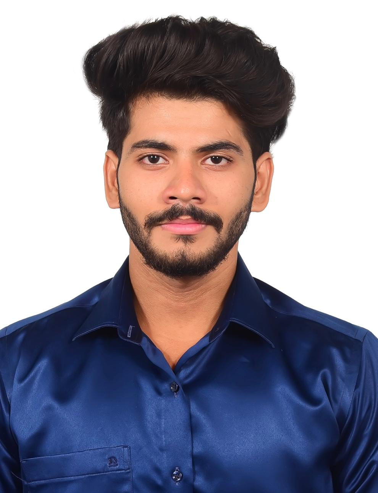

<!-- ====================== PREMIUM CYBER HEADER ====================== -->

  

<table>
  <tr>
    <td width="65%" valign="center">
      

        
        
        
          
        
      

      

      <b>## 👨‍💻 ABOUT ME</b>  
      I am an <b>AI/ML Engineer</b> currently working at <b>Enarxi Innovation Pvt Ltd</b>. I specialize in developing end-to-end intelligent systems, ranging from <b>Real-Time Computer Vision</b> models (YOLOv8, OpenCV) to <b>Enterprise Generative AI</b> agents (LLMs, RAG, LangGraph). I am passionate about optimizing backend architectures and deploying AI applications with sub-second inference latency.
    </td>
    <td width="35%" align="center" valign="center">
      
    </td>
  </tr>
</table>

<table>
  <tr>
    <td width="50%" valign="top">
      <h3>🚀 Core Focus</h3>
      <ul>
        <li><b>Computer Vision:</b> Real-time Object Detection & Tracking</li>
        <li><b>Generative AI:</b> Multi-Agent Systems, RAG Pipelines</li>
        <li><b>Backend Development:</b> Scalable APIs, Vector Databases</li>
        <li><b>Intelligent Automation:</b> Complex Data Extraction & Bots</li>
      </ul>
    </td>
    <td width="50%" valign="top">
      <h3>🎓 Education</h3>
      <b>B.Tech - Computer Science & Engineering</b> 
      BS Abdur Rahman Crescent Institute Of Science and Technology 
      <i>2022 - 2026</i>
    </td>
  </tr>
</table>

---

## 💼 PROFESSIONAL EXPERIENCE

### 🔹 AI/ML Engineer @ Enarxi Innovation Pvt Ltd
*Feb 2026 – Present | Chennai, India*

*   **Computer Vision Solutions:**
    *   Developed an AI-powered **Conveyor Belt Monitoring System** for JSW Steel using **YOLOv8** (96% defect detection accuracy, 70% reduction in manual inspection).
    *   Built a real-time **Material Detection and Classification** pipeline processing 30+ FPS (95% accuracy).
    *   Designed a **Cement Bag Counting System** automating inventory verification (99% counting accuracy).
*   **Generative AI & LLMs:**
    *   Developed an enterprise **AI Agent** using **LLMs, RAG, FastAPI, and vector databases**, reducing document retrieval time from minutes to seconds.
*   **Intelligent Automation:**
    *   Engineered a **BOM Automation** solution that reduced manual processing time by 60% and improved data extraction accuracy to 98%.
*   **System Integration:**
    *   Integrated YOLOv8, OpenCV, FastAPI, PostgreSQL, and REST APIs to deploy scalable AI applications with sub-second latency.

---

## 🛠️ TECH STACK

<table>
  <tr>
    <td width="33%" align="center">
      <h3>🧠 AI & Machine Learning</h3>
       
        
      <b>Machine Learning • Deep Learning</b> 
      Computer Vision • NLP 
      GenAI • LLMs • RAG 
      LangChain • LangGraph • YOLOv8
    </td>
    <td width="33%" align="center">
      <h3>💻 Languages & DBs</h3>
       
        
      <b>Python • SQL</b> 
      PostgreSQL • MongoDB 
    </td>
    <td width="33%" align="center">
      <h3>⚙️ Frameworks & Tools</h3>
       
        
      <b>FastAPI • Flask</b> 
      Playwright • AI Automation 
      Chatbots • AI Agents
    </td>
  </tr>
</table>

---

## 📂 FEATURED PROJECTS

<table>
  <tr>
    <td width="50%" valign="top">
      <h3>🤖 LangGraph AI QA Web App</h3>
      
<i>FastAPI • LangGraph • Gemini LLM • RAG</i>

      <ul>
        <li>Built an AI-powered QA platform delivering contextual, document-aware responses through intelligent workflow orchestration.</li>
        <li>Designed a multi-stage pipeline with query validation, intent routing, document retrieval, and retry mechanisms.</li>
      </ul>
    </td>
    <td width="50%" valign="top">
      <h3>🎬 AI Movie Synopsis Evaluation</h3>
      
<i>Flask • Gemini API • Multi-Agent</i>

      <ul>
        <li>Built a multi-agent AI application to analyze movie synopses and generate AI-powered genre classification and scoring.</li>
        <li>Designed a modular architecture with specialized agents for analysis, classification, and response generation.</li>
      </ul>
    </td>
  </tr>
</table>

---

## 📈 GITHUB STATS & ACTIVITY

  
    
  

<table>
  <tr>
    <td width="50%" align="center">
      
    </td>
    <td width="50%" align="center">
      
    </td>
  </tr>
</table>

  

 

  <picture>
    <source media="(prefers-color-scheme: dark)" srcset="https://raw.githubusercontent.com/MohamedAfzal0719/MohamedAfzal0719/output/github-contribution-grid-snake-dark.svg">
    <source media="(prefers-color-scheme: light)" srcset="https://raw.githubusercontent.com/MohamedAfzal0719/MohamedAfzal0719/output/github-contribution-grid-snake.svg">
    
  </picture>

---

## 🏆 CERTIFICATIONS & COMPETENCIES

<table>
  <tr>
    <td width="50%" valign="top">
      <h3>📜 Certifications</h3>
      <ul>
        <li><b>Data Science</b> — Besant Technologies</li>
        <li><b>AI & ML</b> — NSP Nexus</li>
        <li><b>Web Development</b> — NSP Nexus</li>
        <li><b>Web Development</b> — IBM</li>
      </ul>
    </td>
    <td width="50%" valign="top">
      <h3>💡 Core Competencies</h3>
      <ul>
        <li>Problem-Solving & Debugging</li>
        <li>Analytical & Data-Driven Thinking</li>
        <li>System Design Thinking</li>
        <li>Technical Communication & Collaboration</li>
      </ul>
    </td>
  </tr>
</table>

  

